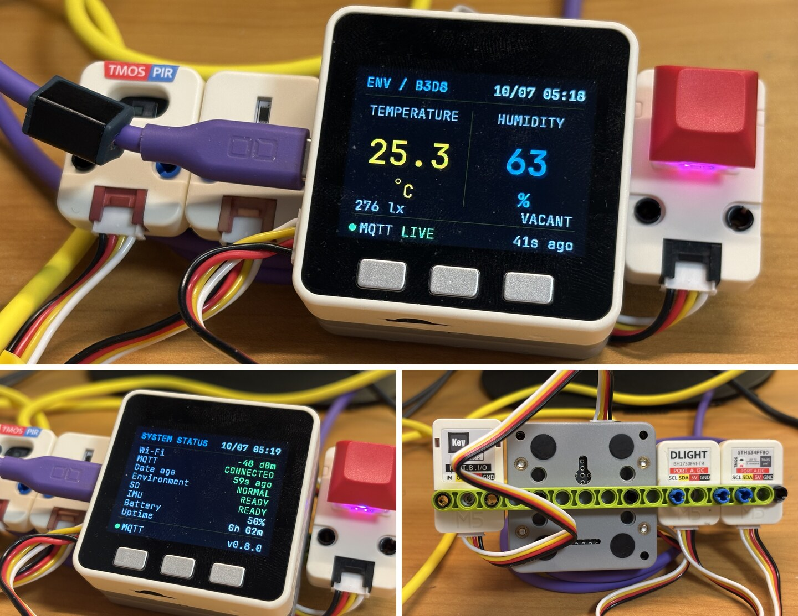

**English** | [日本語](README.ja.md)

# M5GO SwitchBot EnvMonitor — v0.8.0

An always-running environmental monitor for M5Stack M5GO v2.7. Home Assistant obtains SwitchBot temperature/humidity measurements and publishes them through an MQTT broker to the M5GO. The device displays current values, SD-backed history and statistics, and uses its built-in LEDs to indicate environmental warnings.



## Features and architecture

`SwitchBot → Home Assistant → MQTT broker (e.g. Mosquitto) → M5GO`

| Feature | Behavior |
| --- | --- |
| Current measurements | 320 × 240 MAIN screen; LIVE / STALE / OFFLINE / WAIT |
| History | Compatible one-minute environment CSV; rolling 24-hour graphs |
| Statistics | Temperature/humidity averages, minima, maxima and previous-window comparison |
| Controls | A/B/C buttons, motion wake, held left/right tilt |
| UI restoration | Page and brightness persisted in NVS; startup Display ON |
| Environmental indicator | Built-in 10 LEDs; off in NORMAL, amber in WARNING, red in CRITICAL |
| Black box | Separate system CSV for connectivity, heap, battery and data freshness |
| Continuous operation | Automatic network retries; LCD backlight off after inactivity; ESP32 keeps running |
| Rendering | 8-bit M5Canvas; embedded JetBrains Mono or FreeMono fallback |

## Hardware and software

| Hardware | Role |
| --- | --- |
| M5Stack M5GO v2.7 / ESP32 | Target device; continuously runs the main loop |
| MPU6886 | Built-in acceleration sensor for wake and tilt |
| SK6812 RGB ×10 | Built-in environmental indicator, GPIO15 |
| microSD | Environment/system CSV; SD CS GPIO4, SPI at 25 MHz |
| LCD | 320 × 240, rotation 1; backlight control |
| A/B/C buttons | Physical controls remain available with IMU gestures |
| Battery | Battery level (%) via M5.Power; raw voltage retained only in system CSV |
| Wi-Fi | MQTT and NTP connectivity |
| Optional TMOS / DLight | Port A presence/motion and illuminance observations; no automatic light control |

A Charger Base is optional, not a firmware requirement. Continuous operation requires an appropriate power source; battery runtime is not specified.

The following is the supplied target environment. The repository does not pin dependency versions. v0.8.0 compiled successfully with the locally installed M5Stack ESP32 package 3.3.9, M5Unified 0.2.21, M5GFX 0.2.28, PubSubClient 2.8 and ArduinoJson 7.4.3 (`m5stack:esp32:m5stack_core`, placeholder configuration). This does not verify the exact M5Unified 0.2.25 / M5GFX 0.2.32 combination or device behavior.

| Dependency | Version / use |
| --- | --- |
| ESP32 board package | 3.3.9; Arduino-ESP32 3.x RMT API |
| M5Unified | 0.2.25 |
| M5GFX | 0.2.32 |
| PubSubClient | 2.8 |
| ArduinoJson | 7.4.3 |
| M5-STHS34PF80 | 0.0.1, official TMOS sensor driver |
| ESP32 bundled APIs | WiFi, Preferences, SD, SPI, time, heap diagnostics, RMT |

No external RGB LED library is required.

Local study-context build: Flash 1,293,263 / 1,310,720 bytes (98%), leaving 17,457 bytes; global RAM 86,612 / 327,680 bytes (26%). Relative to the TMOS-only baseline (1,291,039 Flash / 86,556 RAM), this adds 2,224 Flash bytes and 56 RAM bytes. Built with ESP32 3.3.9, M5Unified 0.2.21, M5GFX 0.2.28 and M5-STHS34PF80 0.0.1. The user has verified device context transitions, including10s presence hold expiry/re-entry and motion not extending the hold.

## Screens and buttons

B short press cycles:

`MAIN → SYSTEM STATUS → TEMP / 24H → HUM / 24H → TEMP / STATS → HUM / STATS → MAIN`

| Page | Contents |
| --- | --- |
| MAIN (`ENV / B3D8`) | Latest temperature/humidity, data state and age |
| SYSTEM STATUS | Wi-Fi RSSI/offline, MQTT, data age, environment state, SD, IMU, battery %, uptime |
| TEMP / 24H | Rolling 24-hour temperature graph from `/logs` |
| HUM / 24H | Rolling 24-hour humidity graph from `/logs` |
| TEMP / STATS | Temperature NOW, 24H AVG/MIN/MAX, PREV AVG, vs PREV |
| HUM / STATS | Same statistics for humidity |

| Button | Short press | Long press (800 ms) |
| --- | --- | --- |
| A | Display OFF | Cycle LCD brightness |
| B | Next page | Reserved; registers activity only |
| C | Return to MAIN | Publish study ceiling-light toggle command |

Short actions occur on release; long actions occur once while held and suppress the short action. While Display OFF, any short or long button action only wakes the display, keeping the current page; its normal action is consumed. Wake occurs at release for a short press or at 800 ms for a long press.

LCD brightness cycles `40 → 80 → 120 → 160 → 220 → 40`; default is 160 and the setting is saved in NVS (`envmonitor` / `brightness`). The display refreshes approximately once a second while on, and also on valid MQTT receipt or button actions. Tilt changes the page and requests graph loading; the regular refresh renders it.

The backlight turns off after 180 seconds without registered activity. Buttons, wake and successful tilt register activity; ordinary motion while on and MQTT receipt do not. This is backlight shutoff, not ESP32 sleep: MQTT, network recovery, NTP, SD logging, IMU and health monitoring continue. MQTT never wakes the display.

## Restart and UI restoration (v0.6.1)

USB removal has been observed to briefly interrupt power and restart the ESP32 with `POWERON_RESET`, even with the IP5306 boost keep-on experiment. v0.6.1 restores UI preferences after a restart; it does not guarantee uninterrupted USB-to-battery switching. The temporary IP5306 experiment was removed; ordinary M5Unified power initialization is used.

| NVS item | Stored value / policy |
| --- | --- |
| Namespace | Existing `envmonitor` |
| `page` | Unsigned byte: MAIN=0, STATUS=1, TEMP / 24H=2, HUM / 24H=3, TEMP / STATS=4, HUM / STATS=5 |
| `brightness` | Existing unsigned-byte index 0–4 for 40/80/120/160/220 |
| Display ON/OFF | Not saved; startup always ON so a successful boot remains visible |

Missing, wrong-type or out-of-range values fall back to MAIN and brightness 160. Existing brightness settings remain compatible. NVS is written only when the page actually changes through B/C or IMU, or A-long changes brightness. Re-selecting the current page does not write. Boot restoration, redraws, MQTT receipt, normal loop iterations, wake and automatic/manual display shutoff do not write. Failed NVS initialization leaves defaults and disables persistence; failed writes are logged without stopping operation. A power loss before a write commits can leave the previous saved state.

Startup order remains M5 initialization → LCD/NVS state load and 8-bit canvas allocation → IMU → RGB → SD → MQTT configuration → Wi-Fi connection start → first restored-page draw. No restored page is drawn before SD initialization. Graph loading waits for valid SD/time and retries on graph redraws after NTP; statistics are calculated on draw. Until time/data is available, empty-history indicators or `--` can appear. The 180-second activity timer starts again after startup.

Wi-Fi and MQTT reconnect normally, subscribe, and reacquire environmental values from retained MQTT. Temperature/humidity, measurement age, time, RSSI, network/session state and graph data are not saved in NVS; they are rebuilt from MQTT, time services and SD. Freshness is still measured from valid receipt time.

SYSTEM STATUS and HEALTH show battery percentage only. The v0.6.0 `/system` CSV schema retains `battery_mv` for compatibility with deployed logs; its observed 0 is an unavailable/useless reading, not proof of an empty battery. No CSV columns or paths were removed.

## Study ceiling-light command (v0.7.0)

While Display ON, C long press (800 ms) publishes once to `home/control/study/ceiling_light/toggle`, payload `PRESS`, **retain=false**, using the existing MQTT connection (QoS 0). The already configured Home Assistant automation calls `light.toggle` for `light.sirinkuraito`; no HA changes are needed. C short press still returns to MAIN. C-long manual network reconnect was removed; automatic Wi-Fi/MQTT reconnect and backoff remain.

The existing long-press latch runs the action once per hold and suppresses the short action on release. While Display OFF, C short/long only wakes the display; release and press again for a toggle. Commands are not queued, retried or saved in NVS. When MQTT is disconnected or publish returns false, Serial reports failure and the environmental LEDs remain unchanged.

Only a successful local publish starts feedback: one LED moves from index 0 to 9 at 30 ms per step (approximately 300 ms total), using subdued Omarchy-inspired blue/light blue/cyan/aqua/muted green. RGB values are `(4,6,8)`, `(6,7,9)`, `(6,9,10)`, `(6,9,8)`, `(7,8,6)` (channels below the existing intensity 12). No extra LED library is used. The `millis()` state machine advances from the loop without animation delays; existing synchronous publish, SD and RMT calls can extend the observed duration. RMT transmission itself retains its existing synchronous API/100 ms timeout.

Feedback temporarily overrides the environmental LEDs. MQTT measurements continue updating during it; after completion, the latest NORMAL/WARNING/CRITICAL state is recomputed and restored. RGB failure does not prevent command publication. Serial logs `LIGHT: toggle command published` or a publish failure. The LEDs indicate a command sent, **not that the light turned on/off**: the M5GO does not track light state, subscribe to state feedback, or change the LCD layout. Publish success does not confirm HA execution or actual light operation.

### Optional SD sound feedback

After successful light-command publish, `/sounds/light-toggle.wav` is streamed from the existing SD card using M5Unified Speaker `playRaw(int16_t*)`. Standard RIFF/WAVE signed 16-bit PCM, mono/stereo, 8–48 kHz is supported; the current approximately 2.5-second 48 kHz stereo file can be used unchanged. No WAV data is embedded or added to Git, and no audio library is added. Place a properly licensed WAV at that path.

Volume is `App::LIGHT_TOGGLE_SOUND_VOLUME = 48` (0–255). Three 8 KB PCM buffers keep asynchronous Speaker requests alive. The loop reads at most one 8 KB chunk when its two-slot channel queue has room, without waiting for the complete sound. SD reads remain synchronous, and slow CSV/statistics/network work can cause audio gaps; playback quality and volume require device testing. The same SD instance is shared by reads and log writes in the main loop; SD is not reinitialized and CSV schemas remain unchanged.

LED feedback still ends after approximately 300 ms and restores environmental LEDs independently of sound. Missing SD/file, invalid WAV, Speaker initialization or queue failure logs an AUDIO warning and does not undo or prevent MQTT/LED success. MQTT failure and Display OFF wake start no sound. A second valid C-long still sends MQTT and restarts LED feedback; sound already active is skipped rather than layered or restarted. Sound means command publication, not actual light ON/OFF or HA confirmation. No boot sound is requested. Compressed/float/extensible WAV is rejected; PCM conversion is needed only for unsupported formats, not the supplied standard 48 kHz file.

## Optional Unit Key (Port B)

Connect Unit Key to Port B: white button signal → GPIO36 (active LOW), yellow SK6812 input → GPIO26 (warm standby LED). Mapping follows the [Unit Key PinMap](https://docs.m5stack.com/en/unit/Unit_Key) and [M5GO v2.7 Port B PinMap](https://docs.m5stack.com/en/core/M5GO_IoT_Kit_v2.7). No new library is needed.

The standard configuration has Unit Key permanently connected to Port B and `#define KEY_UNIT_ENABLED 1`. For operation without Unit Key, set it to `0` and rebuild. At `0`, KEY initialization, GPIO36 polling and actions are excluded at compile time. GPIO36 is input-only without internal pull-up; enabled mode uses `INPUT` and relies on Unit Key's internal10kΩ pull-up. No external pull-up is added; do not leave KEY enabled with the unit absent/disconnected.

A30ms non-blocking debounce accepts a press once and rearms only after a debounced release. A key held at boot does not toggle until released and pressed again. KEY calls the same `publishStudyLightToggle()` as C-long: MQTT PRESS, success LED feedback and `/sounds/light-toggle.wav`, with existing failure and audio-busy behavior. KEY works with Display OFF and never wakes the display or updates its inactivity timer. Physical A/B/C wake-only behavior is unchanged. GPIO26 independently drives Unit Key's SK6812 as a warm standby indicator: gentle, irregular brightness changes (~3–20%) continue during button presses and Display OFF. The base color follows 24 distinct hourly hue-circle points interpolated in local time (warm fallback before clock synchronization). DLight lux continuously scales the existing brightness fluctuation with gradual tracking; unavailable or stale DLight returns smoothly to standard brightness. Three smooth low-frequency components are combined using fixed-point arithmetic and sent through an independent asynchronous RMT channel, without a new LED library. KEY_UNIT_ENABLED=0 excludes both button and LED; LED initialization failure leaves the button usable.

Debounced events produce `PERF KEY press t=...`, `PERF KEY action t=...`, and `PERF KEY release t=...`. Action means an attempt; the existing LIGHT log reports MQTT publication success/failure.

## Optional Port A TMOS unit

TMOS PIR UNIT (STHS34PF80, I²C `0x5A`) shares M5Unified's existing `In_I2C` on Port A (SDA GPIO21 / SCL GPIO22). Unit transactions use 100kHz; the bus is not released or reinitialized, preserving internal IMU communication.

DRDY is checked every50ms, with ODR8Hz, presence/motion thresholds200 and hysteresis50. Successful ready reads update presence/motion flags for the study context below. TMOS has no display or light-control action; the Gesture-dependent wake path remains removed.

Install M5-STHS34PF80 **0.0.1**. Missing/failed initialization disables only TMOS; read failures and recovery are logged. Initialization uses a500ms deadline checked between I²C transactions. Restart after reconnecting an uninitialized unit.

PERF retains `tmos_poll_max_us`, `last_us`, `calls` and `tmos_errors`, alongside all existing loop/UI/cache metrics.

Set the sketch's `TMOS_DIAGNOSTICS` to `1` and rebuild to enable approximately1Hz `TMOS STATE:` flag/hold/freshness diagnostics. Default `0` excludes the detailed diagnostic code and buffers at compile time; normal PERF and sensor/context logic remain active.

Gesture UNIT was evaluated but rejected as a production light-control input because of false positives. See [the device evaluation](docs/gesture-unit-evaluation.md).

## Study environmental context (TMOS + DLight)

Connect TMOS (`0x5A`) and DLight/BH1750FVI (`0x23`) to Port A with a Y-GROVE cable. Both share SDA GPIO21 / SCL GPIO22 at100kHz for unit transactions; the internal IMU bus is not reinitialized. DLight uses M5Unified `In_I2C.start/write/read/stop`, following the [official M5-DLight commands and lux conversion](https://github.com/m5stack/M5-DLight/blob/master/src/M5_DLight.cpp). No additional DLight library is required. The locally installed M5-DLight0.0.3 was inspected but is not linked; its raw-count `getLUX()` differs from the current official raw/1.2 conversion used here.

| Sensor | Role / schedule |
| --- | --- |
| TMOS | Observe presence/motion; existing50ms DRDY check, ODR8Hz |
| DLight | Observe illuminance; continuous high-resolution mode (`0x10`), read every1s; raw16-bit big-endian value /1.2 |
| Physical C-long | Explicit ceiling-light toggle; existing MQTT, LED and sound |

**TMOS/DLight never control the light or wake/sleep the display.** Optional KEY UNIT provides explicit light input when enabled (see above). Gesture remains removed.

| Lux | Light state |
| --- | --- |
| `<50` | DARK |
| `50–<300` | DIM |
| `300–<1000` | NORMAL |
| `>=1000` | BRIGHT |

Adjust `App::DLIGHT_DARK_LUX`, `DLIGHT_NORMAL_LUX`, `DLIGHT_BRIGHT_LUX` after device measurements. Classification currently has no lux hysteresis. Occupancy is held for10s after the last successful presence=1 sample; motion is reported separately and does not extend occupancy. Raw negative samples do not immediately clear the hold. TMOS data expires after2s, DLight after3s, and a read error immediately invalidates that sensor until a successful ready sample/read. Missing sensors produce UNKNOWN, rather than assumed darkness/vacancy. Initialization is attempted at startup only; restart if a missing unit is reconnected.

Valid observations yield `VACANT_DARK`, `VACANT_LIGHT`, `OCCUPIED_DARK`, or `OCCUPIED_LIGHT`; DIM/NORMAL/BRIGHT all count as LIGHT. If either sensor is invalid, combined context is `UNKNOWN`. This expresses sensor observations, not guaranteed human occupancy.

MAIN adds illuminance and held occupancy at the bottom of its content area; invalid values show `LUX --` / `PRESENCE --`. The six pages and existing refresh timing are retained.

MQTT publishes non-retained QoS0 snapshots to `home/env/study/context` on classification/occupancy/motion/validity changes, after reconnection, or every60s. Attempts are limited to once per1s; intermediate changes may be coalesced, and lux changes within the same class appear at the heartbeat. No offline queue is added. Existing connected PubSubClient publish is synchronous; network fault timing still requires device PERF checks.

```json
{"lux":327.4,"light_state":"NORMAL","occupied":true,"motion":false,"context":"OCCUPIED_LIGHT"}
```

Invalid lux is `null` with `light_state:"UNKNOWN"`; invalid presence/motion are `null`, and combined context is `UNKNOWN`. MQTT failure does not change observations or trigger light actions. Serial prints successful DLight readings once per1s (`DLIGHT: lux=327.4 state=NORMAL`), context transitions and read failure/recovery. PERF adds `dlight_poll_max_us`, `last_us`, `dlight_calls`, `dlight_errors`; this measures only the I²C read, excluding Serial/MQTT/LCD. Conversion completes in the sensor with no loop wait; physical I²C transactions remain synchronous under existing driver timeouts.

No context SD log or DLight graph is added. Existing temperature/humidity and system CSV schemas, Graph/STATS caches, buttons, NVS, IMU and180s auto-off remain unchanged.

## IMU gestures

| Gesture / setting | Implementation |
| --- | --- |
| Sampling | Acceleration read approximately every 100 ms |
| Motion wake (Display OFF) | Absolute difference between successive acceleration magnitudes ≥ 0.22 g; 3,000 ms wake cooldown |
| Left tilt (Display ON) | Horizontal acceleration ≤ −0.55 g held for 500 ms → TEMP / 24H |
| Right tilt (Display ON) | Horizontal acceleration ≥ +0.55 g held for 500 ms → HUM / 24H |
| Tilt cooldown | 1,500 ms after a tilt action or motion wake |
| Neutral / release | Absolute horizontal acceleration ≤ 0.30 g clears pending tilt and releases the latch |
| Direction adjustment | `App::IMU_REVERSE_LEFT_RIGHT = false`; set true to invert X polarity for a reversed mounting orientation |

Horizontal acceleration is accelerometer X (`ax`), optionally inverted; thresholds are acceleration components, not angles. A direction change starts a new hold; dropping below the tilt threshold cancels the pending hold. After an action, the latch prevents repeated switching until neutral is observed. Motion wake clears the hold and sets the latch, so the same movement cannot immediately switch pages. The first sample after display shutoff establishes the magnitude baseline. An unavailable IMU disables motion features while leaving buttons usable.

User-reported device checks confirm left → TEMP / 24H, right → HUM / 24H and motion wake. The user also confirmed v0.7.0 light operation and RGB feedback before this audio update; these device checks were not repeated here.

## Environmental thresholds and RGB LEDs

Critical is evaluated first; either temperature or humidity can determine the state. Comparisons outside the ranges are strict (`<` / `>`).

| State | Condition | LEDs |
| --- | --- | --- |
| NORMAL | Temperature 18–28 °C **and** humidity 40–70%, inclusive; also before any valid data | All off |
| WARNING | Not CRITICAL, and temperature <18 or >28 °C **or** humidity <40 or >70% | First 3 amber; remaining 7 off |
| CRITICAL | Temperature <15 or >32 °C **or** humidity <30 or >80% | All 10 red |

Exactly 15/32 °C or 30/80% is WARNING unless another metric is CRITICAL. `RGB_LED_BRIGHTNESS = 12` is a channel intensity (0–255): amber RGB=(12,6,0), red RGB=(12,0,0). It is independent of LCD brightness. LEDs indicate abnormal conditions rather than decoration.

GPIO15 uses Arduino-ESP32 RMT at 10 MHz, four memory blocks and 240 symbols/frame, with GRB byte order. Each bit is 0.4 µs HIGH + 0.8 µs LOW for 0, or 0.8 µs HIGH + 0.4 µs LOW for 1. Initialization clears all LEDs; RMT initialization/initial-clear failure disables RGB operation.

LEDs update on valid MQTT receipt and remain independent of Display OFF. The state uses the last accepted values without freshness gating or hysteresis: an old warning can remain lit, and NORMAL does not guarantee connectivity or fresh data.

## SD logging and black box

```text
/
├── logs/
│   └── YYYY-MM-DD.csv     # environment history; compatible schema
├── sounds/
│   └── light-toggle.wav   # optional sound; supplied separately
└── system/
    └── YYYY-MM-DD.csv     # system diagnostic black box
```

Both streams share a 60,000 ms logging check. Files use the local date (`TZ_INFO`, default JST) and append rows; a header is written only when a file does not exist. Each write closes the file. Logging requires available SD and a valid clock (`time >= 1704067200`, 2024-01-01 UTC). Before clock validity, neither stream writes and there is no unsynchronized file or later backfill. Clock validity is a timestamp test, not proof of a fresh NTP response.

`/logs` additionally requires at least one valid MQTT measurement. Once received, the last values continue to be logged even when STALE/OFFLINE; there is no freshness filter. `/system` records even in WAIT and is intended for later investigation of Wi-Fi/MQTT outages and memory conditions. These are periodic snapshots, not a complete event trace.

### Environment CSV (unchanged)

```csv
timestamp,temperature,humidity,rssi,mqtt
```

| Field | Meaning |
| --- | --- |
| timestamp | Local `YYYY-MM-DD HH:MM:SS`, logging time |
| temperature | Last accepted temperature in °C, one decimal |
| humidity | Last accepted relative humidity in %, one decimal |
| rssi | Wi-Fi RSSI in dBm; 0 when disconnected |
| mqtt | 1 connected, 0 disconnected |

### System CSV

```csv
timestamp,rssi,wifi,mqtt,heap,min_heap,largest_heap,battery_pct,battery_mv,data_state,data_age_s
```

| Field | Meaning |
| --- | --- |
| timestamp | Same local logging timestamp format |
| rssi | Wi-Fi RSSI in dBm; 0 when disconnected |
| wifi | 1 when `WL_CONNECTED`, otherwise 0 |
| mqtt | 1 connected, 0 disconnected |
| heap | Current free heap, bytes (`ESP.getFreeHeap`) |
| min_heap | Minimum free heap since boot, bytes (`ESP.getMinFreeHeap`) |
| largest_heap | Largest allocatable 8-bit heap block, bytes |
| battery_pct | M5.Power battery level, % |
| battery_mv | Raw M5.Power battery voltage, mV; observed as 0 on this M5GO v2.7 configuration, not a meaningful voltage reading |
| data_state | WAIT / LIVE / STALE / OFFLINE |
| data_age_s | Seconds since last accepted MQTT receipt; 0 in WAIT |

SD initialization failure disables logging and SD history while measurement display/network operation continue. Directory/file-open failures are reported to Serial and do not stop the main loop. There is no SD remount/recovery loop, buffering/backfill, retention cleanup, or verified write-byte/durability check; after later I/O failures the SD status may still say READY. Check Serial and files when diagnosing storage. Export/archive CSV externally as needed.

## Graphs and statistics

Graphs read environment CSV into 288 five-minute buckets over a rolling 24-hour window. The last row read in each bucket wins (no bucket averaging); missing buckets break the line. Data reloads on entry via STATUS → TEMP / 24H, on tilt, or every five minutes while a graph page is visible. The vertical scale follows data with 15% padding (minimum 0.5). Empty graphs show `NO 24H DATA` or `SD UNAVAILABLE`.

Statistics reread CSV at every statistics-page draw, using all parsed rows with finite values for each metric, independently of graph buckets, RSSI and MQTT flags.

| Item | Calculation |
| --- | --- |
| NOW | Last accepted MQTT value, even if STALE/OFFLINE; does not require SD/time |
| 24H AVG | Arithmetic mean of rows in `[now − 24 h, now]`; equal weight per row |
| 24H MIN / MAX | Minimum / maximum in that same interval |
| PREV AVG | Arithmetic mean in `[now − 48 h, now − 24 h)` |
| vs PREV | Current 24H AVG minus PREV AVG; °C or humidity percentage points |

PREV is the preceding rolling 24-hour interval, **not the previous calendar day**. No interpolation, time weighting or completeness requirement is applied; stale values logged repeatedly contribute repeatedly. Missing SD/time or rows yields `--` for historical values; missing current data yields `--` for NOW. Temperature displays one decimal, humidity whole numbers; calculations use floats. Positive differences are orange, negative cyan.

## MQTT, configuration and operation

Copy `config.example.h` to local `config.h` and edit locally:

```sh
cp config.example.h config.h
```

Keep `config.h` ignored and never publish SSIDs, Wi-Fi/MQTT passwords or other credentials. Set `WIFI_SSID`, `WIFI_PASSWORD`, `MQTT_HOST`, `MQTT_PORT`, `MQTT_USERNAME`, `MQTT_PASSWORD` for your environment without copying them into documentation. An empty MQTT username selects a connection without username/password.

| Public configuration | Current default |
| --- | --- |
| `MQTT_TOPIC_ENV` | `home/env/switchbot-b3d8/raw` |
| `MQTT_CLIENT_ID` | `m5go-switchbot-b3d8` (use a unique ID per device) |
| `MQTT_PORT` | 1883 |
| `TZ_INFO` | `JST-9` |
| NTP servers | `ntp.nict.jp`, `ntp.jst.mfeed.ad.jp`, `pool.ntp.org` |

```json
{"id":"switchbot-b3d8","temperature":24.9,"humidity":62.0}
```

Only the configured topic is accepted, subscribed at QoS 0. JSON must have numeric temperature and humidity; finite temperature −50…80 °C and humidity 0…100% are accepted, inclusive. Invalid messages do not update values or receipt time. `id` is not validated or required; no measurement timestamp is consumed. The client buffer is 512 bytes. The firmware uses `WiFiClient` (no TLS), receives measurements and publishes only the light-control command described above.

[Home Assistant example](home-assistant/switchbot-b3d8-mqtt.yaml) publishes on either entity's state change, Home Assistant startup and every minute, with a two-second delay, basic unavailable-state filtering, retain=true and QoS 0. Adapt the `sensor.meter_b3d8_temperature` / `sensor.meter_b3d8_humidity` entities locally. A retained old message is treated as newly received; data age measures the delivery path, not the underlying sensor measurement age.

| Network / reliability item | Implementation |
| --- | --- |
| Wi-Fi | STA; persistent configuration off, auto reconnect on, Wi-Fi sleep off |
| Wi-Fi retry | Initial connection wait 15 s; retry delays 5 → 10 → 20 → 40 → 60 s, capped; reset on connection |
| MQTT retry | Only with Wi-Fi connected; failed attempts delayed 2 → 4 → 8 → 16 → 32 → 60 s, capped; reset on successful connect + subscribe |
| MQTT connection | Keepalive 30 s; socket timeout 5 s; subscribe failure disconnects; Wi-Fi loss disconnects MQTT |
| Freshness | WAIT before first valid message; LIVE <180 s; STALE 180–<600 s; OFFLINE ≥600 s |
| NTP | `configTzTime` configured once when Wi-Fi becomes available; underlying time service handles synchronization |
| Serial diagnostics | 115200 baud; boot reset reason and heap; network/error messages; HEALTH every 5 min |
| HEALTH | Uptime, Wi-Fi/MQTT, RSSI, free/minimum/largest heap, data state/age, SD/IMU, battery, environment state |

Retries use deadline checks and exponential backoff in the main loop. MQTT connect/socket operations and SD reads/writes are synchronous; this is not a guarantee of uninterrupted UI response. Heap is observed, with no automatic heap-triggered restart. Canvas allocation failure is fatal and stops setup; SD/IMU/RGB initialization failures are handled separately. No device/endurance test was performed for this v0.7.0 update.

## Repository and fonts

| Path | Purpose |
| --- | --- |
| `M5GO-SwitchBot-EnvMonitor.ino` | Firmware; `App` constants are the implemented thresholds/timers |
| `config.example.h` / local `config.h` | Configuration template / private settings |
| `README.md` / `README.ja.md` | English / Japanese documentation |
| `home-assistant/` | MQTT publisher example |
| `JetBrainsMono*pt7b.h` | Embedded generated font headers |
| `tools/install_jetbrains_mono.sh` | macOS font download/conversion helper |
| `fonts/README.md`, `FONT-NOTICE.md`, `OFL-JetBrainsMono.txt` | Font instructions and license |

Open the sketch in Arduino IDE with the M5GO-compatible ESP32 board selected and the dependencies installed. Generated font headers are already present; font regeneration is optional. No LittleFS font upload is used. All three headers must be available to select JetBrains Mono; otherwise the sketch uses M5GFX FreeMono fonts.

JetBrains Mono is under SIL OFL 1.1; see [font notice](FONT-NOTICE.md) and [OFL](OFL-JetBrainsMono.txt). The repository's `LICENSE` is currently empty, so an application license is not specified.
